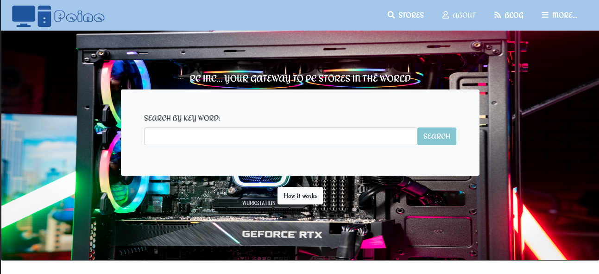

# Getting the first proyect Directory of Stores

> This is a project for us to learn about of bootstrap of News Week, making it responsive through mobile, tablet and desktop.

## Built With

- Git
- Github
- VSCode
- HTML5
- CSS3
- Flexbox
- Grid
- Bootstrap
- Fontawesome
- Google Chrome Inspector
- Linters

## Live Demo

[Live Demo Link](https://kiranitor123.github.io/store-directory/dist/)

## Getting Started

First you can clone this repositori using a Descktop Application, or using SSH.
Next go tu Usage section.

For linters-checking purposes, run:

`npm install`

`npx hint .`

`npx stylelint "**/*.{css,scss}"`

To get a local copy up and running follow these simple example steps.

### Prerequisites

Owning a web broser :D

### To review

Just clone the github repositori

Using a GitHub Descktop program or SSH protocol
### Usage

Just run index.html on browser, or run in the command line, like this:

`firefox index.html`

or

`google-chrome index.html`

## Author

👤 **Rolando**

- GitHub: [@Rolando](https://github.com/kiranitor123)
- Twitter: [@rolando](https://twitter.com/FayeRolando)
- LinkedIn: [Rolando](https://www.linkedin.com/in/rolando-diego-alvarez-faye-b2b34a1a9/)

## 🤝 Contributing

Contributions, issues, and feature requests are welcome!

Feel free to check the [issues page](../../issues/).

## Show your support

Give a ⭐️ if you like this project!

## 📝 License

This project is Licensed under a [Creative Commons Attribution 4.0 International License (CC BY)](https://creativecommons.org/licenses/by/4.0/).